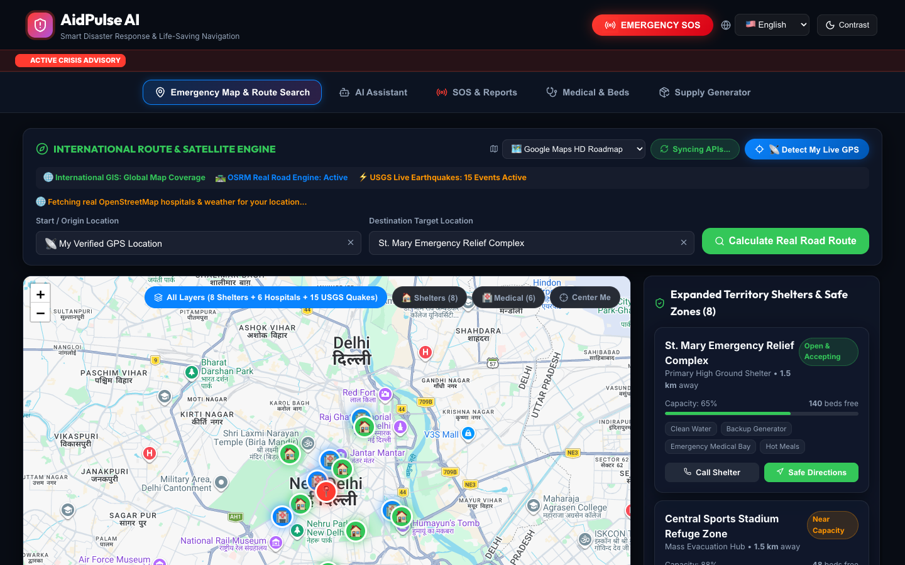
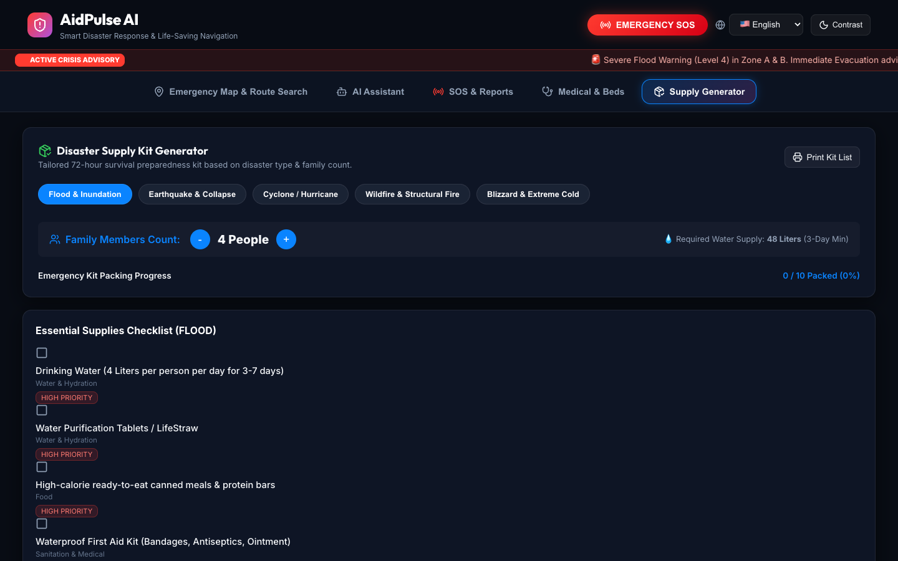
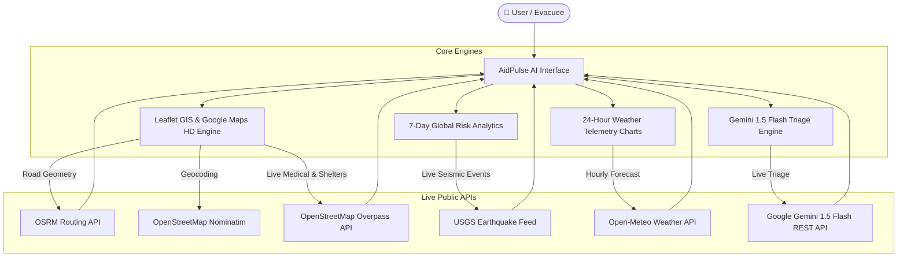

# AidPulse AI — Smart Emergency & Disaster Response System 🌐⚡

> **Hackathon Submission:** AidPulse AI is a real-time, AI-powered emergency management and disaster response platform. Built with **React 18, Vite, Leaflet GIS, Google Gemini 1.5 Flash API, OSRM Real Road Snapping, USGS Seismic Telemetry, and Open-Meteo Weather APIs**, AidPulse AI provides life-saving guidance, street-snapped evacuation routing, hospital bed tracking, and 7-day predictive disaster risk modeling.

---

## 🖼️ Application Screenshots & Visual Showcase

| Interactive GIS Evacuation Map & OSRM Road Snapping | Gemini 1.5 Flash AI Emergency Assistant |
| :---: | :---: |
|  |  |

| Hospital ER & ICU Bed Tracker | Emergency Survival Supply Kit Calculator |
| :---: | :---: |
|  |  |

---

## 🌟 Core Features & Capabilities

- 🏠 **Location-Based Shelter & Safe Zone Finder**: Dynamically ranks nearby regional emergency shelters and OpenStreetMap community refuges by real-time capacity and distance.
- 🛣️ **OSRM Real Road Network Routing**: Snaps evacuation routes 100% onto actual street roads, avenues, rotaries, and highways with turn-by-turn driving guidance.
- 🎯 **Dual Typeahead Destination & Origin Search**: Free-text search inputs with OpenStreetMap Nominatim geocoding to calculate safe routes between any two global locations.
- 🏥 **Hospital ER & ICU Bed Tracker**: Real-time free bed counts, ICU units, oxygen reserve hours, blood bank metrics, and 24/7 direct 112/911 triage calling.
- 🔮 **Gemini 1.5 Flash 7-Day Global Disaster Predictor**: AI-driven satellite predictive risk modeling (LOW, MODERATE, HIGH, CRITICAL) for any region worldwide.
- ⚡ **USGS Live Global Earthquake Feed**: Real-time seismic event mapping with magnitude, depth, location, and official event links.
- 🌧️ **24-Hour Weather Telemetry & Forecast Charts**: Interactive hourly rain precipitation bar charts and temperature curve trend charts powered by Open-Meteo API.
- 🚨 **One-Tap SOS Emergency Dispatch**: Instant priority rescue call modal with real-time GPS dispatch tracking.
- 🌐 **6-Language Multilingual Support**: Accessible in English, Spanish, Hindi, French, Bengali, and Arabic.

---

## 🏗️ System Architecture & Workflow



---

## 🛠️ Tech Stack & Technologies Used

| Layer | Technology |
|---|---|
| **Frontend Framework** | React 18 (Hooks, Context, Functional Components) |
| **Build Tool & Server** | Vite 8 |
| **GIS & Mapping** | Leaflet.js, React-Leaflet, CartoDB Voyager, Google Maps HD Tiles |
| **Routing Engine** | OSRM (Open Source Routing Machine) API |
| **AI Triage & Prediction** | Google Gemini 1.5 Flash API (`gemini-1.5-flash`) |
| **Geocoding & Data** | OpenStreetMap Nominatim & Overpass Turbo APIs |
| **Seismic Telemetry** | USGS Earthquake GeoJSON Feed |
| **Weather Forecasts** | Open-Meteo Free Public Weather API |
| **Iconography** | Lucide React Icons |
| **Styling** | Custom Glassmorphism CSS Architecture |

---

## 🚀 Quick Start & Installation

### Prerequisites
- Node.js `v18.0.0` or higher
- npm `v9.0.0` or higher

### Step-by-Step Setup

1. **Clone the Repository**:
   ```bash
   git clone https://github.com/shreshth0007/AidPulse-AI.git
   cd AidPulse-AI
   ```

2. **Install Dependencies**:
   ```bash
   npm install
   ```

3. **Configure Environment Variables**:
   Create a `.env` file in the root directory:
   ```env
   VITE_GEMINI_API_KEY=YOUR_GEMINI_API_KEY_HERE
   ```

4. **Launch Development Server**:
   ```bash
   npm run dev
   ```
   Open **`http://localhost:5173/`** or **`http://localhost:5174/`** in your browser.

5. **Build for Production**:
   ```bash
   npm run build
   ```

---

## 🔒 Security & Environment Variables

- In accordance with best security practices, local API keys are stored strictly in client-side `.env` files and `localStorage`.
- `.env` files are excluded from Git version control via `.gitignore`.

---

## 📜 License
Distributed under the MIT License. See `LICENSE` for more information.
