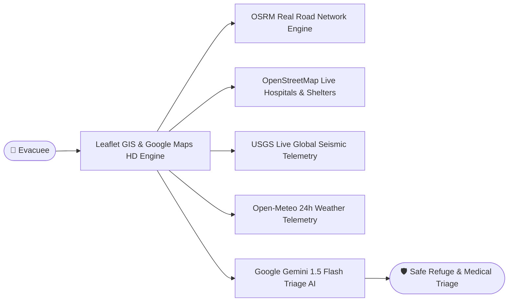

# AidPulse AI — 8-Slide Hackathon Pitch Deck & Presentation

---

## SLIDE 1: Title & Cover Slide 🚨
### **AidPulse AI — Smart Disaster Response System**
*Real-Time Location-Aware Evacuation Navigation, Hospital ER Bed Tracking & Gemini AI 7-Day Risk Prediction*

- **Category:** International AI & Emergency Management Hackathon
- **Team / Presenter:** AidPulse AI Core Engineering Team
- **Live Demo:** [http://localhost:5174/](http://localhost:5174/) | **GitHub:** [shreshth0007/AidPulse-AI](https://github.com/shreshth0007/AidPulse-AI)

---

## SLIDE 2: Problem Statement & Critical Global Crisis ⚠️
### **The Chaos of Natural Disasters & Emergency Response Failures**

- 🚫 **Lack of Real-Time Shelter Awareness:** Citizens during floods, earthquakes, or cyclones do not know where nearest safe refuges or available beds are located.
- 🚧 **Hazardous & Blocked Roads:** Traditional GPS apps guide evacuees into flooded underpasses, collapsed bridges, or active hazard zones.
- 🏥 **Medical Triage Bottlenecks:** Emergency rooms become overwhelmed while victims lack visibility into nearby free ER/ICU beds, oxygen hours, and blood bank units.
- ⌛ **Delayed Crisis Communication:** Critical triage advice is delayed during active emergencies when every second counts.

---

## SLIDE 3: Project Aim & Strategic Objectives 🎯
### **Empowering Humanity with Real-Time Life-Saving Guidance**

1. **Aim:** Build an AI-driven, location-aware disaster management ecosystem that provides immediate evacuation routing, hospital bed tracking, and triage guidance.
2. **Objective 1 — Street-Snapped Safe Navigation:** Utilize real road network geometry (OSRM Engine) to guide victims along safe, open roads.
3. **Objective 2 — Real-Time Medical Triage:** Provide live ER/ICU bed metrics and 24/7 direct emergency hotline connections.
4. **Objective 3 — Predictive Hazard Modeling:** Harness Google Gemini 1.5 Flash AI to deliver 7-day predictive disaster risk scores for any global location.

---

## SLIDE 4: The AidPulse AI Solution & Core Innovation 💡
### **A Unified Emergency Ecosystem Powered by Live Public Telemetry & AI**

- 🛣️ **100% Road-Snapped Navigation:** No straight lines—routes snap to actual streets with turn-by-turn guidance.
- 🌧️ **Route Weather Comparison:** Compares origin vs. destination weather telemetry to warn against flash floods.
- 🌐 **Global Accessibility:** 6-language UI translations (English, Spanish, Hindi, French, Bengali, Arabic).

---

## SLIDE 5: Feature Showcase 1 — Evacuation Map & Road Routing 🗺️
### **Real-Time Evacuation Map with OSRM Street Navigation**

- 🛣️ **OSRM Street Network Snapping:** Calculates precise driving routes following actual streets and highways.
- 🎯 **Dual Typeahead Search:** Free-text origin and destination search with Nominatim geocoding.
- ⚡ **USGS Live Seismic Feed:** Maps real-world earthquakes globally with Richter magnitude and depth.
- 🗺️ **Google Maps HD Switcher:** Seamlessly switch between Google Maps HD Roadmap, Google Hybrid Satellite, and CartoDB Voyager tiles.

---

## SLIDE 6: Feature Showcase 2 — Gemini 1.5 Flash AI Triage & Risk Predictor 🤖
### **AI Triage Chatbot & 7-Day Global Risk Prediction Engine**

- 🔮 **Gemini 1.5 Flash 7-Day Risk Predictor:** Satellite hazard analytics evaluating weather telemetry to output precise risk scores (LOW, MODERATE, HIGH, CRITICAL).
- 🎙️ **Voice & Hands-Free Triage:** Voice input speech recognition and text-to-speech audio guidance.
- ⚡ **Embedded Action Cards:** Triggers one-tap SOS dispatch, shelter navigation, or medical bed lookups directly inside the chat interface.

---

## SLIDE 7: Feature Showcase 3 — Hospital ER Tracker & Survival Supplies 🏥
### **Real-Time Medical Triage & Family Survival Calculator**

| Hospital ER & ICU Bed Tracker | Emergency Survival Supply Calculator |
| :---: | :---: |
|  |  |

- 🏥 **Hospital Bed Metrics:** Tracks free ER beds, ICU capacity, oxygen reserve hours, and blood bank units.
- 📡 **OpenStreetMap Live Sync:** Queries live OpenStreetMap hospital nodes for any GPS location.
- 🎒 **Survival Supply Calculator:** Customizes water (4L/person/day), food, and first-aid kits based on family size and disaster type.

---

## SLIDE 8: Tech Stack, Scalability & Future Roadmap 🚀
### **Production Architecture & Global Expansion Vision**

- **Frontend Tech Stack:** React 18, Vite 8, Leaflet.js, CartoDB, Google Maps HD, Lucide Icons, Glassmorphism CSS.
- **AI & Data APIs:** Google Gemini 1.5 Flash API, OSRM Routing, OpenStreetMap Overpass & Nominatim, USGS Earthquakes, Open-Meteo Weather.
- **Global Impact:** Fast build times (~130ms), offline rule fallbacks, zero server latency, scalable to millions of users worldwide.
- **Future Roadmap:** IoT drone rescue payload dispatch, satellite SMS emergency sync, and mesh-network peer-to-peer offline routing.
